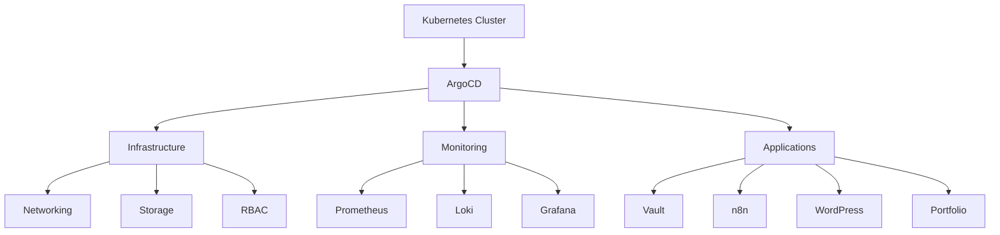

# Homelab Kubernetes GitOps

  
  

This repository manages a homelab Kubernetes cluster using GitOps principles. It leverages [ArgoCD](https://argo-cd.readthedocs.io/), [Kustomize](https://kubectl.docs.kubernetes.io/references/kustomize/), and [Helm](https://helm.sh/) to automate infrastructure, networking, monitoring, and application deployments. The goal is to provide a reproducible, secure, and observable platform for running self-hosted services.

---

## Architecture Overview

## Repository Structure

- **infrastructure/**  
  Core cluster components, controllers, networking, namespaces, and ArgoCD bootstrapping.
- **monitoring/**  
  Monitoring stack, including Prometheus, Loki, Grafana, and related dashboards.
- **my-apps/**  
  User applications, dashboards, and custom workloads managed via GitOps.

---

## :computer: Hardware

### Nodes
I use a combination of Dell OptiPlex pc's and old desktops to run a few virtual machines. The mini PC's are great because they are small and cheap to buy when you get them refurbished from a reseller.

Dell OptiPlex 7050 PC i5-6500T/16GB/500GB SSD

Dell OptiPlex 5050 PC i5-6500T/16GB/500GB SSD

Dell OptiPlex 5050 PC i5-6500T/16GB/500GB SSD

## Key Applications

| Logo | Name | Description |
|------|------|-------------|
|  | [ArgoCD](https://github.com/argoproj/argo-cd) | Declarative GitOps continuous delivery for Kubernetes. |
|  | [Kustomize](https://github.com/kubernetes-sigs/kustomize) | Native Kubernetes configuration customization. |
|  | [Helm](https://github.com/helm/helm) | Package manager for Kubernetes applications. |
|  | [Cert-Manager](https://github.com/cert-manager/cert-manager) | Automated TLS certificate management (integrated with Cloudflare DNS01). |
|  | [Cloudflare Zero Trust](https://developers.cloudflare.com/cloudflare-one/) | Used for private tunnels to expose public services (without requiring a public IP). |
|  | [Traefik](https://github.com/traefik/traefik) | Kubernetes-native ingress controller. |
|  | [Prometheus](https://github.com/prometheus/prometheus) | Metrics collection and alerting toolkit. |
|  | [Grafana](https://github.com/grafana/grafana) | Visualization and dashboarding for metrics/logs. |
|  | [Vault](https://www.vaultproject.io/) | Secrets management with Kubernetes auth integration. |
|  | [n8n](https://n8n.io/) | Workflow automation platform with 300+ integrations. |
|  | [WordPress](https://wordpress.org/) | Content management system with persistent storage. |
|  | [Portfolio](https://portfolio.isandeshsol.com/) | Personal portfolio website developed with Hugo. |
|  | [CloudNativePG](https://cloudnative-pg.io/) | Database operator for running PostgreSQL clusters in Kubernetes. |
## Security Notes

- All components are managed declaratively and versioned in git.
- TLS is automated via Cert-Manager and Cloudflare DNS01.
- Sensitive values (secrets, tokens) should be managed outside of git, using sealed-secrets or external secret managers if possible.
- RBAC and network policies are recommended for production-like setups.

---

## Observability

- **Prometheus** collects cluster and application metrics.
- **Loki** aggregates logs from all workloads.
- **Grafana** provides dashboards for metrics and logs, with pre-configured data sources and derived fields for trace correlation.
- Default dashboards and alerting rules are included for cluster health and workload monitoring.

---

## Contributing

Contributions are welcome! Please open issues or pull requests for improvements, bug fixes, or new features. For major changes, discuss them in an issue first.

---

## References

- [ArgoCD](https://argo-cd.readthedocs.io/)
- [Kustomize](https://kubectl.docs.kubernetes.io/references/kustomize/)
- [Helm](https://helm.sh/)
- [Cert-Manager](https://cert-manager.io/)
- [Cloudflared](https://developers.cloudflare.com/cloudflare-one/connections/connect-apps/)
- [Prometheus](https://prometheus.io/)
- [Loki](https://grafana.com/oss/loki/)
- [Grafana](https://grafana.com/)
- [Vault](https://www.vaultproject.io/)
- [n8n](https://n8n.io/)
- [WordPress](https://wordpress.org/)
- [Hugo](https://gohugo.io/)
---

## License

This project is licensed under the MIT License.